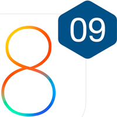

# Day 9 :: Designated Initializers

{float=left}

The concept of designated initializers is not new to the Cocoa world - they 
exist in objective-C, but somewhat informally. Swift formalizes class initialization,
both in terms of what the different initialization methods should do, and the
order in which things should be done.

In order to ease interoperability with objective-C, there is also a little more
formalization there too.

In this post you'll learn a bit about how initialization works in Swift, with
an explanation of what designated initializers are, and how they related to
convenience initializers.

The accompanying code for this project is part of an Xcode playground - and is
available in the repo on github at
[github.com/ShinobiControls/iOS8-day-by-day](https://github.com/ShinobiControls/iOS8-day-by-day).
You should be able to just open it up and see the live-run results.

## Creating objects

Initializers are used to instantiate an instance of a class or a struct. There are
two types of initializer:

- __Designated__ This is responsible for preparing all the properties, and calling
the superclass' initializer, allowing it to do the same.
- __Convenience__ Don't have to directly prepare and instance state, but must
call a designated initializer. Cannot call an initializer of the superclass.

For example:

    class Person {
      var name: String
      var age: Int?
      var consideredDangerous = false

      init(name: String, age: Int?) {
        self.name = name
        self.age = age
      }
    }

This is a class which has 3 properties. `init(name:,age:)` is a designated
initializer, and therefore it is responsible for ensuring that all properties have
been correctly initialized. In the example above that actually only means that it
must set a value for the `name` property. This is because optionals will be set
to `nil` by default, and `consideredDangerous` is set inline.

Since the age is optional, we might want to offer another initializer which just
accepts a name. One option would be to make another designated initializer:

    init(name: String) {
      self.name = name
    }

This is perfectly acceptable, but it is actually repeating the same code as in
the previous designated initializer. Should you decide to store uppercase names,
then you'd have to change both initializers. This is where the concept of initializer
chaining comes in - which is the pattern established with convenience initializers.

### Convenience Initializers

Convenience initializers are denoted by the use of the `convenience` keyword, and
they __must__ call a designated initializer:

    convenience init(name: String) {
      self.init(name: name, age: nil)
    }

This method now has the desired behavior - it only requires a name, and delegates
the actual initialization to a designated initializer. Convenience initializers
__cannot__ call the super class, but __must__ call a designated initializer in the
same class.

### Subclassing

When you create a subclass then in addition to the aforementioned rules associated
with designated initializers, you are also required to call a designated
initializer of the superclass.

Look at the following example - a ninja is clearly a person, but they have a
collection of weapons, defined by the accompanying enum:

    class Ninja: Person {
      var weapons: [Weapon]?
    }

    enum Weapon {
      case Katana, Tsuba, Shuriken, Kusarigama, Fukiya
    }

The `Ninja` class definition doesn't currently have an initializer, and since
the only additional property is an optional (and thus defaults to nil) it isn't
a requirement to have one. However, it'd be nice to add one which allows setting
the weapons array at initialization time:

    init(name: String, age: Int?, weapons: [Weapon]?) {
      self.weapons = weapons

      super.init(name: name, age: age)

      self.consideredDangerous = true
    }

This demonstrates the rules of how a designated initializer must be formed in
Swift:

1. Any properties on the subclass must be initialized correctly. Here it's not
strictly necessary since `weapons` is an optional type.
2. Once the current object's properties are all initialized, there __must__ be
a call to a designated initializer on the superclass.
3. You can then update any properties inherited from the superclass.

This order is very important, and changing it will result in compiler errors. Note
that the order is different to the ordering used in subclass initializers in
objective-C, where the call to the superclass is the first instruction.

You can add convenience initializers to subclasses as well, but they must call
a designated initializer of the same class. They __cannot__ call an initializer
of a superclass:

    convenience init(name: String) {
      self.init(name: name, age: nil, weapons: nil)
    }

This results in you being able to create ninjas in 2 ways:

    let tina = Ninja(name: "tina", age: 23, weapons: [.Fukiya, .Tsuba])
    let trevor = Ninja(name: "trevor")

## Usage in objective-C

Objective-C has the notion of designated initializers - but in an informal context.
In order to enable full interoperability between objective-C and Swift, there is
a macro with which you can annotate your objective-C initializers:
`NS_DESIGNATED_INITIALIZER`:

    - (instancetype)init NS_DESIGNATED_INITIALIZER;

By using this, then all other initializers in your class will be interpreted as
being convenience initializers. The same rules apply with objective-C initializers
as their Swift counterparts.

## Conclusion

The designated initializer pattern has existed in the Cocoa world for a long time,
but Swift formalizes it somewhat. You'll need to fully understand it and what
is required of you as a developer in order to create your own classes and subclasses
in Swift.

It's also definitely worth adopting the new macro in any new objective-C that you
write, particularly if you want it to be interoperable with Swift code.

The code which accompanies this post is in the form of an Xcode 6 playground -
and demonstrates how the different patterns work. It is part of the day-by-day
repo on the ShinobiControls github at
[github.com/ShinobiControls/iOS8-day-by-day](https://github.com/ShinobiControls/iOS8-day-by-day).
